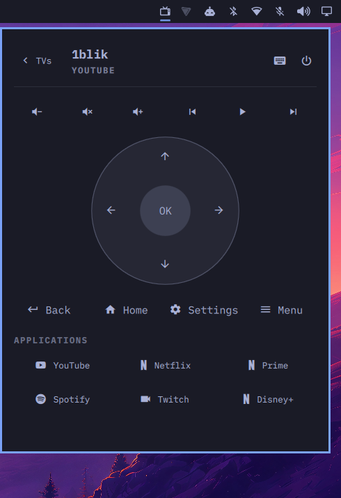
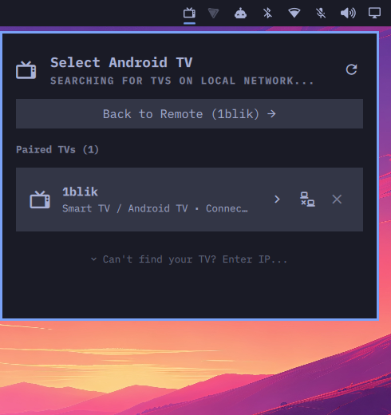

# Android TV & Google TV Remote for Omarchy

[](https://omarchyplugins.com)
[](LICENSE)
[](manifest.json)
[](https://github.com/erickdevit/omarchy-androidtv-remote)

A native virtual remote control plugin for **Android TV** and **Google TV**, integrated directly into the **Omarchy** status bar and shell.

Powered by the official **Android TV Remote v2** protocol (TLS/Protobuf encrypted over ports `6466` and `6467`) — the exact same protocol used by Google TV and Google Home mobile apps. **No ADB debugging, root, or developer mode required on your TV.**

---

## Preview

> [!NOTE]
> *Screenshots captured directly from the live Omarchy shell.*

| Remote Control View | TV Management & Discovery |
| :---: | :---: |
|  |  |

---

## Key Features

- **Official Google TV / Android TV v2 Protocol**: Direct TLS connection with low latency (< 5ms) and authenticated cryptographic handshake.
- **Automatic Local Network Discovery (mDNS / Zeroconf)**: Automatically finds TVs on your local network without manual IP configuration.
- **Multi-TV Management**:
  - Real-time status for paired TVs (Connected, On, Standby).
  - One-click Connect, Disconnect, and Unpair actions.
  - Discovery list for new available TVs ready to pair.
  - Manual IP fallback connection if mDNS is restricted on your network.
- **Seamless Omarchy Bar Integration**:
  - Dynamic status icon reflecting TV state (On, Standby, Disconnected).
  - **Left-Click**: Toggle the virtual remote control popup.
  - **Right-Click**: Toggle TV Power (On / Off) immediately.
  - **Middle-Click**: Toggle Mute immediately.
  - Informative tooltip displaying TV name, active app, and connection status.
- **Full Navigation Controls**:
  - **Virtual D-Pad**: Up, Down, Left, Right, and center `OK` button.
  - **Quick Actions**: Back, Home, Settings, and Menu / Input.
- **Volume & Playback Controls**:
  - Volume Down, Mute, and Volume Up.
  - Dynamic **Play / Pause** toggle button that alternates its icon and active highlight based on current playback state.
  - Previous track and Next track buttons.
- **1-Click App Launcher**:
  - Fast-launch shortcuts for **YouTube**, **Netflix**, **Prime Video**, **Disney+**, **Spotify**, and **Twitch**.
- **Smart On-Screen Typing (IME)**:
  - Automatically detects when a text field is focused on the TV (YouTube search, Play Store, login screens) and opens a typing input field.
  - Send text directly from your PC keyboard to the TV with Enter.
- **Full Keyboard Navigation**:
  - Control navigation, playback, and volume directly from your physical keyboard while the remote popup is focused.

---

## Keyboard Shortcuts

When the remote panel is open:

| Key | Action |
| :--- | :--- |
| `Arrow Keys` | D-Pad Navigation (Up, Down, Left, Right) |
| `Enter` / `Space on OK` | Select / OK |
| `Esc` / `Backspace` / `B` | Back |
| `H` | Home Screen |
| `Space` / `P` | Toggle Play / Pause |
| `+` / `-` | Volume Up / Volume Down |
| `M` | Toggle Mute |

---

## Installation

### Method 1: Using Omarchy Plugin Manager (Recommended)

Run the following command in your terminal:

```bash
omarchy plugin add https://github.com/erickdevit/omarchy-androidtv-remote.git --enable
```

Omarchy will automatically clone the repository, validate the manifest schema, and enable the widget in your bar.

### Method 2: Manual Installation

```bash
git clone https://github.com/erickdevit/omarchy-androidtv-remote.git ~/.config/omarchy/plugins/erick.androidtv-remote
omarchy plugin enable erick.androidtv-remote
```

### Uninstallation

To disable and remove the plugin:

```bash
omarchy plugin disable erick.androidtv-remote
omarchy plugin remove erick.androidtv-remote
```

Or if installed manually:

```bash
rm -rf ~/.config/omarchy/plugins/erick.androidtv-remote
```

---

## Pairing Guide

1. Ensure your computer and Android TV / Google TV are connected to the **same local network (Wi-Fi or Ethernet)**.
2. Click the TV icon in your Omarchy bar.
3. In the **"Available Devices"** list, find your TV and click **"Pair"**.
4. A 6-digit alphanumeric code will appear on your TV screen.
5. Enter the code in the PIN prompt in the Omarchy panel and click **"OK"**.
6. That's it! Your TV is paired and the remote is ready to use.

---

## Command Line Interface (CLI)

The plugin includes the `omarchy-androidtv-remote` CLI utility for scripting, terminal control, and custom Hyprland keybindings:

```bash
# Navigation Keys
omarchy-androidtv-remote key UP
omarchy-androidtv-remote key DOWN
omarchy-androidtv-remote key LEFT
omarchy-androidtv-remote key RIGHT
omarchy-androidtv-remote key OK
omarchy-androidtv-remote key BACK
omarchy-androidtv-remote key HOME
omarchy-androidtv-remote key POWER

# Volume & Media
omarchy-androidtv-remote key VOL_UP
omarchy-androidtv-remote key VOL_DOWN
omarchy-androidtv-remote key MUTE
omarchy-androidtv-remote key PLAY_PAUSE
omarchy-androidtv-remote key PLAY
omarchy-androidtv-remote key PAUSE
omarchy-androidtv-remote key NEXT
omarchy-androidtv-remote key PREV

# Launch Apps
omarchy-androidtv-remote app youtube
omarchy-androidtv-remote app netflix
omarchy-androidtv-remote app prime
omarchy-androidtv-remote app spotify

# Send Text Typing
omarchy-androidtv-remote text "Search query"

# Query Status in JSON
omarchy-androidtv-remote status
```

---

## Security & Privacy

- **No ADB Required**: Does not require USB/Network debugging or insecure developer permissions on your television.
- **Encrypted TLS**: All messages are TLS-encrypted with local certificates generated autonomously in `~/.local/state/omarchy/androidtv-remote/`.
- **100% Local**: No credentials, telemetry, or user data leave your local network.
- **Omarchy Compliant**: Strictly follows the Omarchy `manifest.json` v1 schema and community security guidelines (zero symlinks, safe relative execution).

---

## License

Distributed under the [MIT License](LICENSE). Developed by [Erick](https://github.com/erickdevit).
